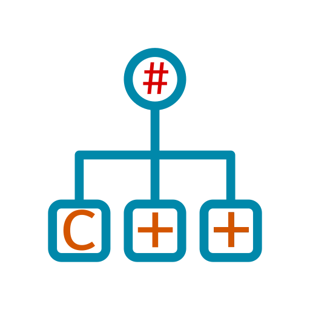

# CppAst.CodeGen    

CppAst.CodeGen is an extensible P/Invoke Code Generator from C/C++ to C# for .NET relying on [CppAst](https://github.com/xoofx/CppAst) for parsing C/C++ 

> This repository is under construction and is still not available for public usage

## License

This software is released under the [BSD-Clause 2 license](https://opensource.org/licenses/BSD-2-Clause). 

## Author

Alexandre Mutel aka [xoofx](http://xoofx.com).
